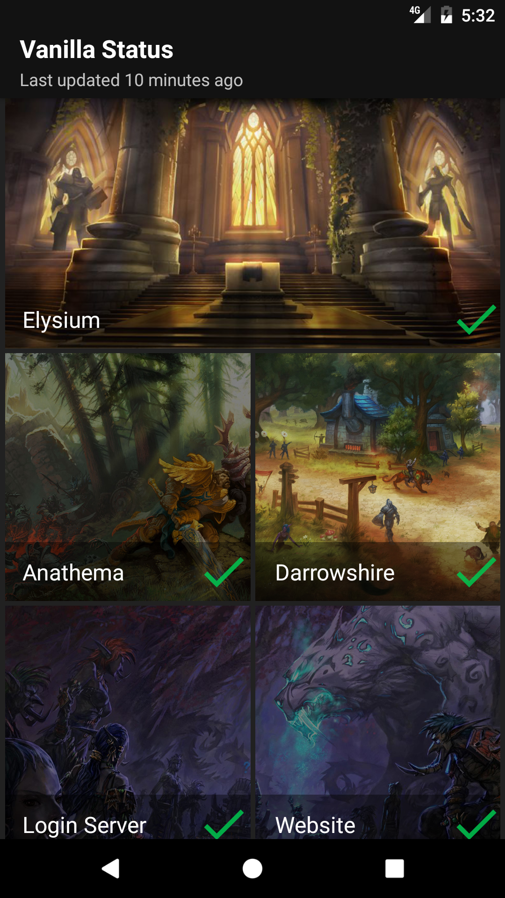
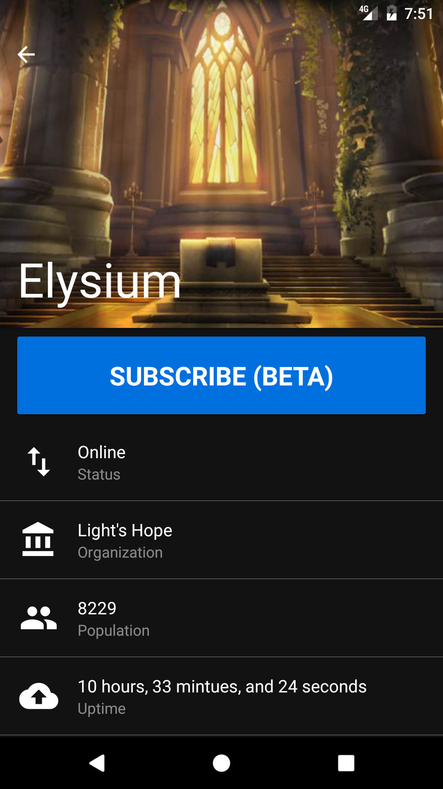
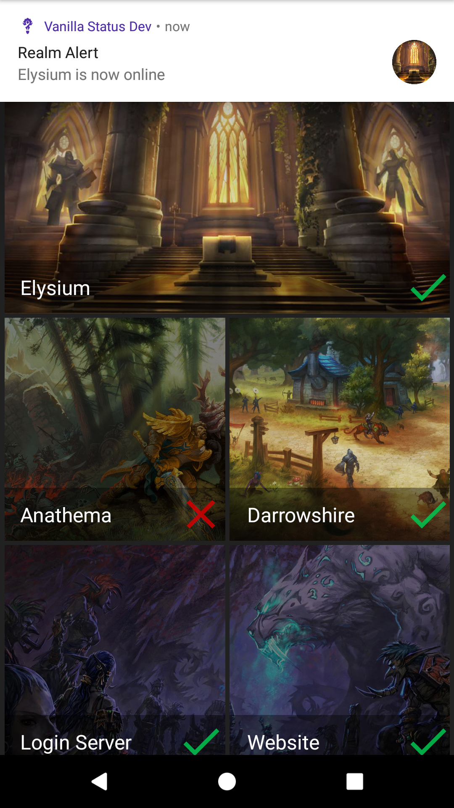

>Mobile App for Android and iOS designed to monitor private WoW servers. It makes the process of checking wow server statuses easier while on the go.

* **Current Status**: Beta (1.0.1-rc1)

#### Status


#### Realm Stats


#### Realm Alert Push Notifications


#### Download

##### Android (Alpha)
https://play.google.com/store/apps/details?id=com.elysiumstatus

##### iOS (Need a iOS device or iOS tester with a device.)
Not yet released

**Supported Supported**
  * Light's Hope
  * Elysium project

* **
# Getting Started
These instructions will get you a copy of the project up and running on your local machine for development and testing purposes.

## Prerequisites
What things you need to install the project
* [React-Native](https://facebook.github.io/react-native)

React native has a great setup guide which should guide you through everything you need to do get started
https://facebook.github.io/react-native/docs/getting-started.html

#### Config files (required)
#### Android (google-services.json)
1. Visit https://firebase.google.com/ and create a free account.
2. Create a new project
3. Click Add Firebase to your Android app
4. Use `com.elysiumstatus.dev` as Package name
5. Add a nickname something like `Vanilla Status Development`
6. Click add app
7. It should have downloaded a `google-services.json` file.
8. Move that file to `android/app/` directory
9. That's it!

## Installing
After you have react-native running, forked & cloned the repo. Running the development project is simple.
### Android
In your project directory use the [`react-native-cli`](https://www.npmjs.com/package/react-native-cli) to start the project
```
react-native run-android
```
It should spawn a react native packager and the development app should automatically be installed. The cli will attempt to start the app on the emulator, but will not find it. It will need to be manually opened.

>[*Make sure you have a device connected or an emulator running*](https://facebook.github.io/react-native/docs/getting-started.html#starting-the-android-virtual-device)

### iOS (macOS Only)
In your project directory use the [`react-native-cli`](https://www.npmjs.com/package/react-native-cli) to start the project
```
react-native run-ios
```
It should spawn a react native packager and the simulator should start and launch the development app.

## Tests
TODO: Write tests using [jest](https://facebook.github.io/jest/)

## Built with
* [ReactNative](https://facebook.github.io/react-native/) - Native App Framework
* [React](https://facebook.github.io/react/) - Javascript UI Library
* [Redux](http://redux.js.org/) - State container for JavaScript
* [Material Design](https://material.io/guidelines/) - Design Guidelines
* [react-native-vector-icons](https://github.com/oblador/react-native-vector-icons) - Vector icons for react native

## Getting involved
Full contribution guidelines listed in [CONTRIBUTING.md](CONTRIBUTING.md)

### Bug Reports
Please submit all bug reports through the repository's Issue Tracker and they will be tagged and prioritized.

### Product Roadmap
List of features where help is desired.

1. ~~Realm Stats - Enhanced realm Stats from https://elysium-project.org/status~~
2. Push Notifications - Realm status notifications
  * User opt in
  * Customizable Notifications (UP, Down)
3. Server Status History - Detailed history of Server statuses
4.  Autologin - Login into wow from anywhere (Bypass the Queues)

## Versioning
We use [SemVer](http://semver.org/) for versioning.

## Authors
* [emmoistner](https://github.com/emmoistner) - *Initial work*

## License
This project is licensed under the MIT License - see the [LICENSE.md](LICENSE.md) file for details

# Acknowledgments
* **Private WoW Server Community**: Elysium Project, Nostalrius
* **Inspiration**: [Elysium-Status](https://github.com/ErlendEllingsen/Elysium-Status) - http://www.elysiumstatus.com
